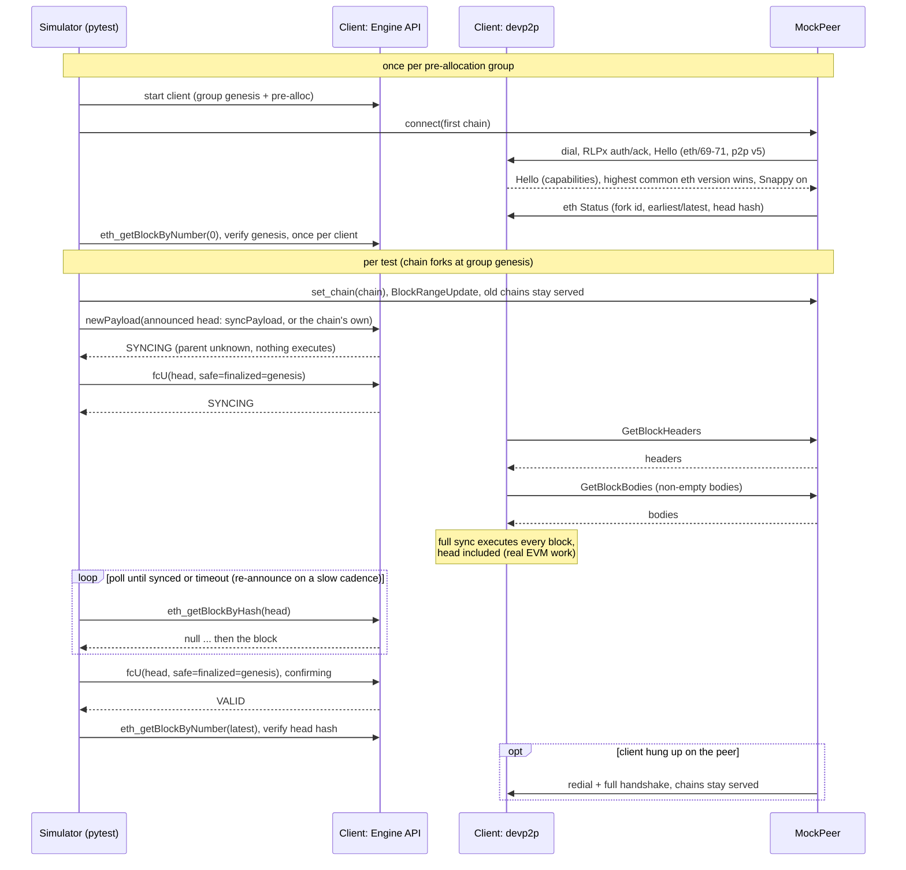

# Consume WireX

The WireX simulator (`eels/consume-wirex`) makes the client under test full sync each test's chain from a deterministic mock devp2p peer implemented inside the testing framework.

The intent is to verify that clients can receive and propagate blocks over devp2p using the consensus test corpus; it is not intended to be a complete test of historical sync. WireX intends to replace [`consume rlp`](../running.md#rlp) for post-Merge forks: instead of loading RLP-encoded blocks through a client-specific offline import mode at startup, the client downloads and executes the same blocks through its production peer-to-peer ingestion path.

## Command Syntax

```bash
uv run consume wirex [OPTIONS]
```

WireX consumes the [Blockchain Engine X Test](../test_formats/blockchain_test_engine_x.md) fixture format and keeps the client topology that [`consume enginex`](../running.md#enginex) established: one client per pre-allocation group, reused across all of the group's tests. Only the way blocks arrive changes. Each test is an independent chain that forks at the group's shared genesis.

To see the WireX-specific options, run:

```bash
uv run consume wirex --help
```

## The Control Plane and the Data Plane

A post-Merge client does not choose its own head; something must tell it what to sync to. WireX splits this deliberately:

- The control plane is the Engine API. One `engine_newPayload` carries the head block and one `engine_forkchoiceUpdated` names it as the head. That is the entire non-devp2p surface of a test.
- The data plane is devp2p. The client downloads headers and bodies from the mock peer over RLPx and executes the blocks itself.

For a chain of N blocks, the Engine API carries only the announced head (inside its payload); devp2p carries the remaining headers and every non-empty body; and the client's full-sync path executes all N blocks. `engine_newPayload` for a block whose parent is unknown executes nothing; it only caches the header and answers `SYNCING`. As long as the announced head's parent is unknown to the client, every block below it is really fetched from the peer and executed by the sync path.

Which block is announced is decided by the fixture's chain class (see [The Sync Block and Chain Classes](#the-sync-block-and-chain-classes)): a fixture carrying an appended sync payload has that trailer announced, so every block the test author wrote is an ancestor the client must download — on every client, by chain structure. Only blocks *below* the announced head are guaranteed to travel devp2p: the head's payload always arrives through the Engine API, and whether a client also re-fetches the head's body from a peer is an implementation choice that measured clients answer both ways.

There is deliberately no rewind between tests. Every test's chain forks at the group's genesis, so announcing the new head is all a consensus client would ever do; a backward forkchoice update is not part of the flow because clients that honor it can enter recovery modes that bypass block execution.

## Process Diagram



A sync is awaited by polling for the head block itself (`eth_getBlockByHash`), never by repeating the forkchoice update: in some clients every forkchoice update restarts the sync cycle, so polling faster than a cycle completes prevents the sync from ever finishing. The announcement is re-sent only on a slow cadence (`--wirex-announce-interval`), and its `engine_newPayload` response is read each time: an `INVALID` answer fails the test immediately with the client's `validationError` instead of waiting for the sync timeout.

## The Mock Peer

The peer is implemented in `execution_testing.devp2p`: an RLPx transport (ECIES handshake, frame MACs, Snappy compression, p2p v5) and the eth wire protocol in versions 69 through 71. The wire dialect is negotiated per the RLPx rule (highest shared version wins) and recorded in every test's transcript; `--wirex-eth-version` pins the advertised set, so an explicit version makes a client that lacks it fail the handshake loudly.

The peer is deliberately honest. It never withholds, reorders or corrupts a response, so a sync failure is a finding about the client or the fixture rather than about the peer. Its behavior in detail:

- Receipts, and from eth/71 block access lists, are counted and left unanswered, never invented. A full-syncing client derives both by executing blocks, so a request for them means the client chose a path this simulator cannot honestly serve. Serving them would convert real failures into silent no-coverage passes; a nonzero unanswered-request count in the transcript is a finding, never noise.
- Chains already served stay served. A client's downloader does not drop the chain it was syncing when a test ends, so the peer answers each request from the chain the requested hash belongs to.
- Responses are bounded by serialized bytes (2 MiB, matching the limit clients themselves serve under), because clients cap the size of every message they read and drop peers that exceed it.
- The peer redials the client after a disconnect, as a real peer would; liveness is checked at each re-announcement.
- Every request and response is recorded in a per-test transcript, which is what makes a stalled sync diagnosable after the fact.

## Rejection Tests

Fixtures containing an intentionally invalid block are not skipped; they run as rejection tests. The peer serves the chain as-is — for an invalid singleton that chain is `G → S → T₁*`, the prepended sync block giving the sync a reason to start below the block under judgement — and once the ancestry has arrived over devp2p, the client must answer `INVALID` to `engine_newPayload` for the head. Accepting an invalid chain fails the test — but only a `VALID` that holds for half a second counts as acceptance. A client answers `newPayload` from the database state of that instant, so while the chain is still arriving that answer can be an artifact rather than a judgement: geth has been observed answering a well-formed `VALID` for a block its own beacon backfill rejected fifteen milliseconds later, and `INVALID` on every ask thereafter. A verdict that outlives the sync is a real one.

Only the fact of rejection is asserted: the Engine API's `validationError` is free-form client text and devp2p carries no error reason at all, so matching the fixture's specific exception over this path is deliberately not attempted (the client's reason text is logged for debugging). The invalid block is executed by the client's sync path, which is distinct coverage from the Engine simulators executing the same fixture via `engine_newPayload`.

One class of fixture cannot travel this path and skips with an explicit reason: a payload whose declared block hash does not match its own header (corrupted at fill time via `rlp_modifier`), because devp2p cannot present a block whose hash differs from its header's keccak.

A rejection target strictly below a reused client's head does not travel the wire either. Such a client refuses to walk its head backwards — geth's sync declines the announcement outright (`chain reorged, tail: 3, head: 3, newHead: 2`) and fetches the same header and body once per re-announcement without ever concluding — so the target's valid ancestry is handed over the Engine API instead, and its head is never named in a forkchoice update at all, because naming it only starts that unfinishable sync. The hand-over precedes the announcement: an idle client executes each ancestor against its parent's state, while a client already syncing towards the head answers for the ancestor without executing it and leaves the head permanently unjudgeable. `engine_newPayload` is idempotent, so the delivery is repeated at every re-announcement and a client that was busy on one attempt executes it on a later one.

If the fixture declares an Engine API error code for the head payload, the client refusing `engine_newPayload` at the RPC layer is itself the expected rejection.

## Test Ordering and Client Reuse

Tests inside each pre-allocation group are ordered by default: valid chains before invalid ones, each by ascending chain length. This exists because a reused client's head number must never decrease (some clients stall permanently when asked to sync a chain shorter than one they already synced) and because serving a bad block can leave a client's sync machinery in a failure state that a following valid sync collides with. `--wirex-no-sort-by-chain-length` disables the ordering, which is useful for reproducing those stalls and for comparison runs.

## The Sync Block and Chain Classes

The fill gives every eligible `blockchain_test_engine_x` chain one framework-built empty block `S` (on by default at fill time; `--no-sync-block` disables it), placed by the chain's own statically declared structure. In the sequences below, `G` is genesis, `T₁…Tₙ` the test's own blocks, `*` marks the block this simulator announces, and `ᵢ` the intentionally invalid block:

| Chain class | Sequence | Extra block | What is wire-guaranteed |
| ----------- | -------- | ----------- | ----------------------- |
| Valid (single or multi-block) | `G → T₁…Tₙ → S*` | appended, out-of-chain (`syncPayload`) | all of `T₁…Tₙ`, on every client |
| Invalid singleton (expected exception or Engine API error code) | `G → S → T₁*` | prepended, in-chain (`payloads[0]`, tagged `"phase": "sync"`) | `S` only; `T₁` is judged after `S` arrives |
| Invalid multi-block | `G → T₁…Tₙᵢ*` | none | `T₁…Tₙ₋₁` already travel the wire |
| Marked ineligible for its class's placement | `G → T₁*` | none | nothing — skipped below the block minimum |

The appended `S` is scaffolding, not test content: `engineNewPayloads`, `lastblockhash` and the post state keep describing exactly the chain the test author wrote, and the sync completes when the client reports `S` as its head. The prepended `S` is load-bearing ancestry — without it the invalid singleton's block has a known parent and no sync ever starts — so it lives in-chain and every consumer replays it.

An appended sync payload counts toward a fixture's chain length: a valid single-block test plus its trailer is a two-block chain, both for the skip accounting and for the chain-length ordering. Fixtures whose chain is still shorter than `--wirex-min-blocks` (default 2) are skipped.

## Wire Coverage

Reaching the head is necessary but not sufficient: the test also asserts that the blocks got there over devp2p. Every block below the announced head whose body cannot be derived from its header alone (an empty transactions trie and an empty withdrawals root leave nothing to download) must have had its body served by this peer, block by block — the failure names the blocks whose bodies never traveled. The announced head is exempt by protocol, and head-body service stays visible in the per-test transcript without being asserted, so a client changing its fetch shape shows up in logs rather than as a false failure.

The serving evidence is cumulative per client, not per test. Valid chains carry no per-test salt, so two tests of one pre-allocation group may declare byte-identical chains; the reused client re-syncs nothing for the second one, because it already imported those blocks when the first one synced. A body that traveled this client's wire connection once satisfies the requirement for every later test of the group, and the run logs when a test was satisfied by earlier service.

## Relationship to Other Simulators

|                        | `consume rlp`                       | `consume sync`                          | `consume wirex`                                    |
| ---------------------- | ----------------------------------- | --------------------------------------- | -------------------------------------------------- |
| Block delivery         | RLP files imported at startup       | devp2p, from a second client            | devp2p, from a framework-controlled mock peer      |
| Client code path       | Client-specific offline import      | Production sync path                    | Production sync path                               |
| Determinism            | Deterministic                       | Depends on the serving client           | Deterministic peer, transcripted                   |
| Clients per test       | One per fixture                     | Two per fixture                         | One per pre-allocation group (reused)              |
| Fork support           | All forks                           | Post-Merge only                         | Post-Merge only                                    |
| Invalid-block fixtures | Rejection implied by final head     | Rejected via Engine API, never synced   | Invalid block travels devp2p, rejection asserted   |

`consume sync` validates client-to-client interoperability on a handful of fixtures; WireX runs the whole test corpus on post-Merge forks against a single deterministic peer. `consume rlp` remains the only simulator covering pre-Merge forks.
